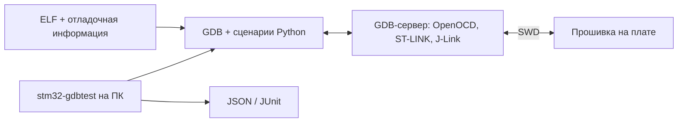

# stm32-hwtest-bluepill

[English](README.en.md)

Демонстрационный проект [stm32-gdbtest](https://github.com/ViacheslavMezentsev/stm32-gdbtest):
проверка работающей прошивки на плате STM32F103 («Blue Pill» и её аналоги) через GDB и
SWD-отладчик сценариями на Python — метод DDTT (Debugger-Driven Testing on Target).
Тестового кода в прошивке нет.

Прошивка намеренно простая: `setup()` один раз после сброса выполняет POST (напряжение
питания и температура кристалла через АЦП) и печатает результат в UART, `loop()` мигает
светодиодом пользователя с частотой 1 Гц. Из библиотек — только CMSIS.



## Платы

| Профиль (`BOARD`) | Плата | MCU | Flash | Светодиод |
| --- | --- | --- | --- | --- |
| `F103C8_PC13` | обычная Blue Pill | STM32F103C8T6 | 64 КиБ | PC13, горит при 0 |
| `F103CB_PB2` | [WeAct BluePill-Plus](https://github.com/WeActStudio/BluePill-Plus) v1.1 | STM32F103CBT6 | 128 КиБ | PB2, горит при 1 |

Во многих STM32F103C8 фактически 128 КиБ Flash (регистр размера показывает 128): прошивка
C8 рассчитана на 64 КиБ, а проверка идентичности даёт предупреждение, а не ошибку. Клоны
MCU (CKS32, GD32, APM32 и др.) не поддерживаются: у них другие DEV_ID и поведение АЦП.

## Требования (Windows)

- [xPack GNU Arm Embedded GCC 14.2.1-1.1](https://github.com/xpack-dev-tools/arm-none-eabi-gcc-xpack/releases/tag/v14.2.1-1.1),
  распакованный в `%USERPROFILE%\xpack-arm-none-eabi-gcc-14.2.1-1.1`, или путь в
  переменной `ARM_TOOLCHAIN_ROOT`;
- CMake ≥ 3.25 и Ninja в `PATH`;
- для HIL-тестов — Python ≥ 3.11 и один из отладчиков: ST-Link (STM32CubeCLT или OpenOCD)
  либо J-Link (SEGGER J-Link Software);
- для дымового теста в эмуляторе — [Renode 1.16.1](https://github.com/renode/renode/releases/tag/v1.16.1) (необязательно);
- VS Code с расширениями CMake Tools, C/C++ и Cortex-Debug (необязательно).

## Получение и сборка

```powershell
git clone --recursive https://github.com/ViacheslavMezentsev/stm32-hwtest-bluepill.git
cd stm32-hwtest-bluepill
cmake --preset Debug_F103C8
cmake --build --preset Debug_F103C8
```

Если репозиторий клонирован без `--recursive`: `git submodule update --init`.

| Пресет | Назначение |
| --- | --- |
| `Debug_F103C8`, `Release_F103C8` | сборка для Blue Pill (`build/<пресет>`) |
| `Debug_F103CB`, `Release_F103CB` | сборка для BluePill-Plus |
| `HIL_F103C8`, `HIL_F103CB` | Debug-сборка с HIL-тестами stm32-gdbtest |

Тестовые пресеты: `Debug_F103C8-emu`, `Debug_F103CB-emu` (Renode), `HIL_*-host` и `HIL_*-hw`.

Результат: `build/<пресет>/stm32_hwtest_bluepill.elf`, `.hex`, `.bin`, `.map`. В VS Code
пресет выбирается в строке состояния CMake Tools; прошивка и отладка — задачи
«Прошить (…)» и конфигурации запуска для ST-Link, OpenOCD и J-Link.

## Вывод UART

USART1, TX — PA9, 115200 бод, 8N1. После сброса печатаются имя платы и результат POST:

```text
stm32-hwtest-bluepill F103CB_PB2
POST: VDDA=3297 mV, T=31.4 C, OK
```

Если у ST-Link есть виртуальный COM-порт (ST-Link V2-1 на Nucleo, ST-Link V3), соедините
PA9 платы с выводом RX (VCP_RX) отладчика и GND — вывод появится в COM-порту отладчика.
Популярные клоны ST-Link V2 COM-порта не имеют: нужен отдельный USB-UART адаптер (PA9 → RX).
Точность POST низкая: у STM32F103 нет заводских калибровок датчика температуры и VREFINT,
расчёт — по типовым значениям datasheet.

## Эмулятор Renode (без платы)

Дымовой тест запускает собранную прошивку в [Renode](https://renode.io) 1.16: модель
`emu/renode/stm32f103.repl` (ядро Cortex-M3, Flash, SRAM, SysTick, USART1; остальная
периферия — заглушки) и проверяет вывод UART, завершение `setup()` и мигание в `loop()`.
АЦП не моделируется, поэтому POST в эмуляторе печатает `FAIL` — это ожидаемо.

```powershell
ctest --preset Debug_F103C8-emu          # или задача VS Code «Эмулятор: дымовой тест (Renode)»
```

Тест появляется, только если CMake нашёл Renode: `RENODE_BINARY`, `PATH` или
`%ProgramFiles%\Renode`; в HIL-пресетах и с `-DBLUEPILL_RENODE_TEST=OFF` его нет. Журналы — `build/<пресет>/renode/`. Подход и версия Renode — как в
[stm32-cmake-yml](https://github.com/ViacheslavMezentsev/stm32-cmake-yml). QEMU здесь не
используется: его машины с Cortex-M3 (`netduino2` — STM32F205, `stm32vldiscovery` — STM32F100
с 8 КиБ SRAM) не совпадают с STM32F103 по памяти и адресам периферии, а прошивка выводит
результаты в USART1, а не через semihosting.

## HIL-тесты

Сценарии в `hil/tests/board` (stm32-gdbtest v0.3.0, 11 сценариев) проверяют прошивку на плате:
кристалл, тактирование и профиль прогона, конфигурацию светодиода и USART1, завершение `setup()`,
POST, мигание и кто пишет время переключения (точка наблюдения), а также реакцию прошивки на
инъекции — подменённый ответ функции и подменённый отсчёт АЦП. Плату описывают описание MCU и
файл данных платы, общие для всех сценариев. Без платы проверяются
трассировка требований и подготовка запуска (`ctest --preset HIL_F103C8-host`); на плате —
`ctest --preset HIL_F103C8-hw` после настройки стенда. Подробно: [hil/README.md](hil/README.md).

Последний аппаратный прогон: BluePill-Plus (`F103CB_PB2`) через J-Link — 11/11 PASS; `F103C8_PC13` проверен без платы.

## Структура

```text
src/            прошивка (C++17): main, setup/loop, плата, POST, UART
cmsis/          подмножество CMSIS из STM32CubeF1 (без изменений)
ld/             скрипт компоновщика (размер Flash — по плате)
cmake/          toolchain и подключение HIL
emu/renode/     модель Renode для дымового теста
tools/          renode_smoke.py — запуск дымового теста
hil/            конфигурации прогона, описания MCU, данные плат, сценарии и требования, стенды
modules/        stm32-gdbtest (Git-подмодуль)
.claude/skills/ навыки агентов stm32-gdbtest
.vscode/        задачи, конфигурации отладки, настройки
.github/        GitHub Actions: форматирование, сборка, Renode, HIL без платы
```

## Документация

- stm32-gdbtest v0.3.0: [README](https://github.com/ViacheslavMezentsev/stm32-gdbtest/blob/v0.3.0/README.md), [справочник API](https://github.com/ViacheslavMezentsev/stm32-gdbtest/blob/v0.3.0/docs/ru/api/index.md),
  [техники тестирования](https://github.com/ViacheslavMezentsev/stm32-gdbtest/blob/v0.3.0/docs/ru/TESTING_TECHNIQUES.md), [навыки агентов](https://github.com/ViacheslavMezentsev/stm32-gdbtest/blob/v0.3.0/skills/README.md).
- Этот проект: [HIL-тесты](hil/README.md), [требования](hil/tests/requirements.md),
  [изменения](CHANGELOG.md), [правила разработки](AGENTS.md).
- Аналогичный пример: [stm32-hwtest-blackpill](https://github.com/ViacheslavMezentsev/stm32-hwtest-blackpill).

## Лицензия

MIT ([LICENSE](LICENSE)). Файлы `cmsis/` — Arm и STMicroelectronics, Apache-2.0
([cmsis/README.md](cmsis/README.md)).
